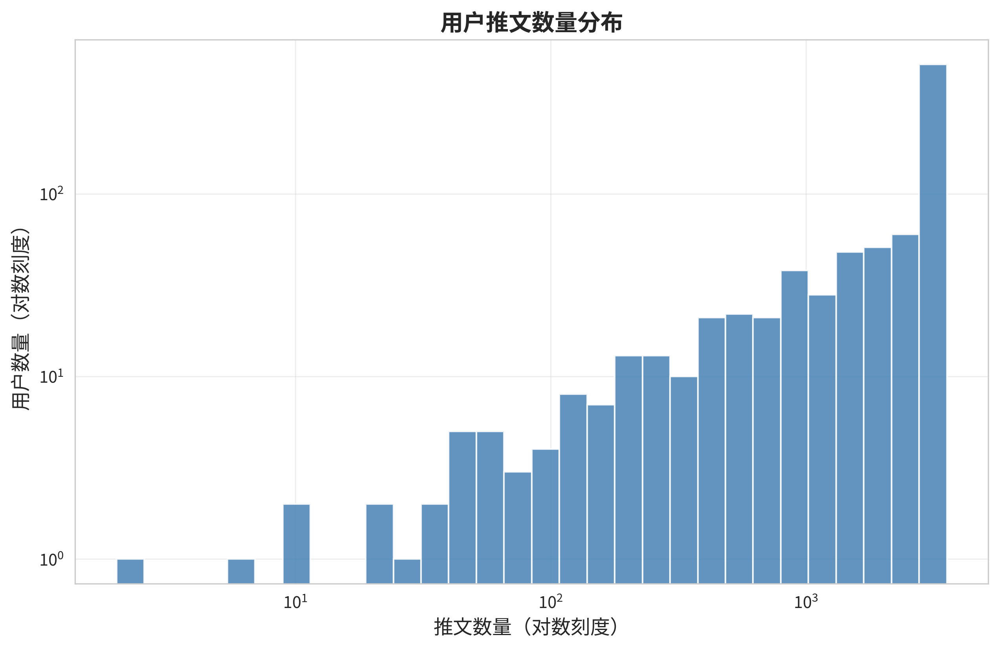
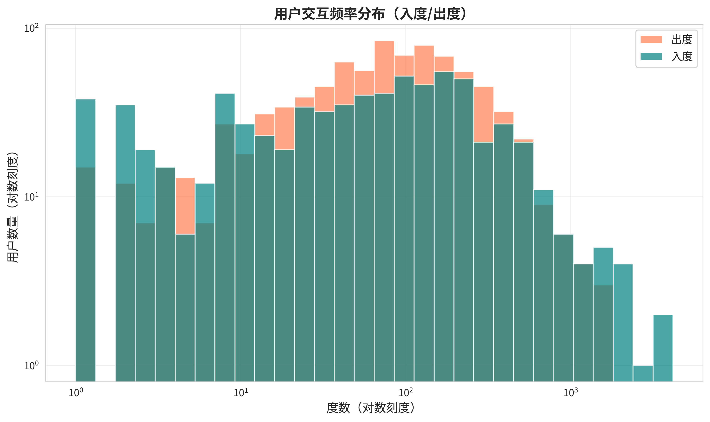
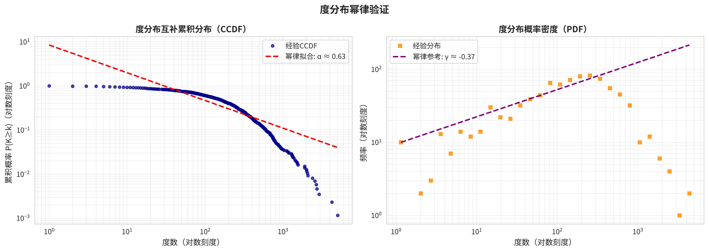
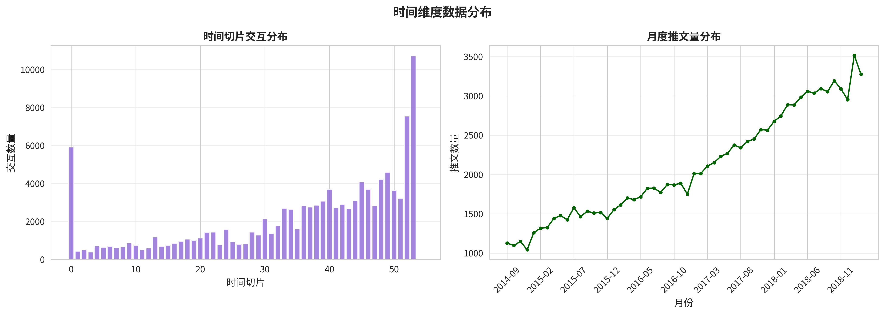
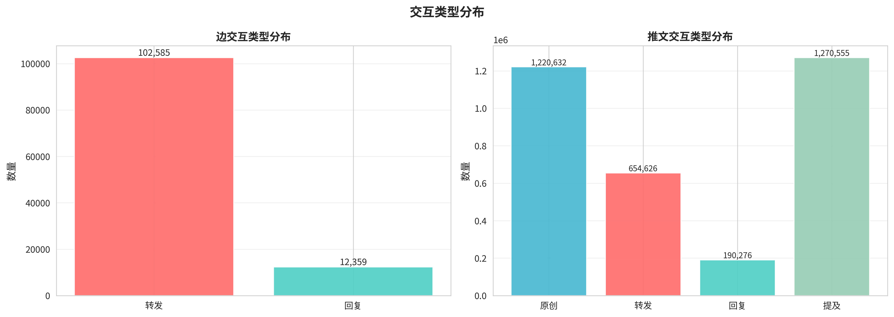
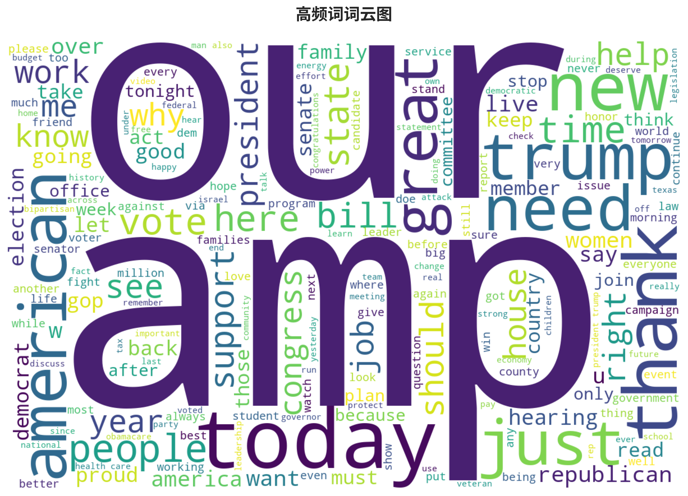
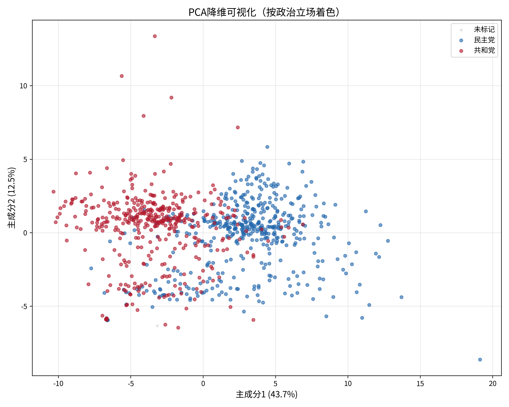
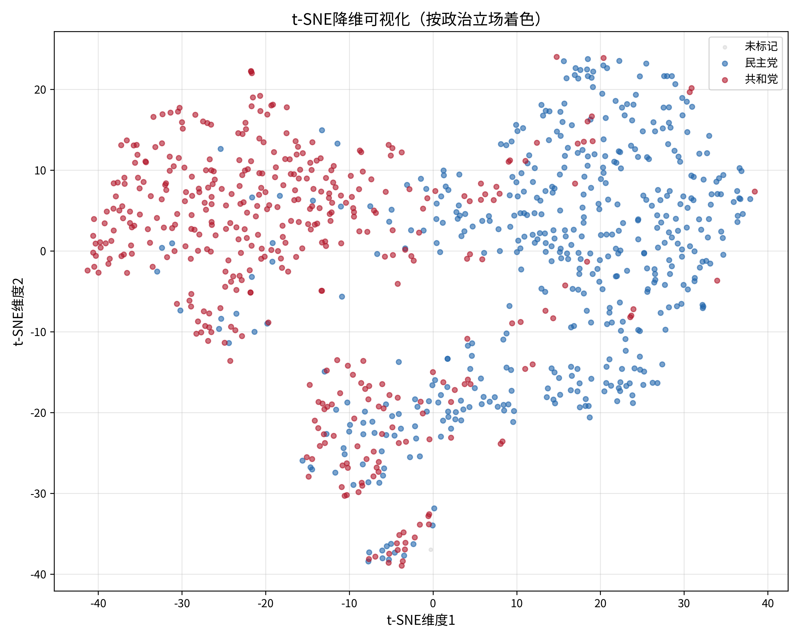
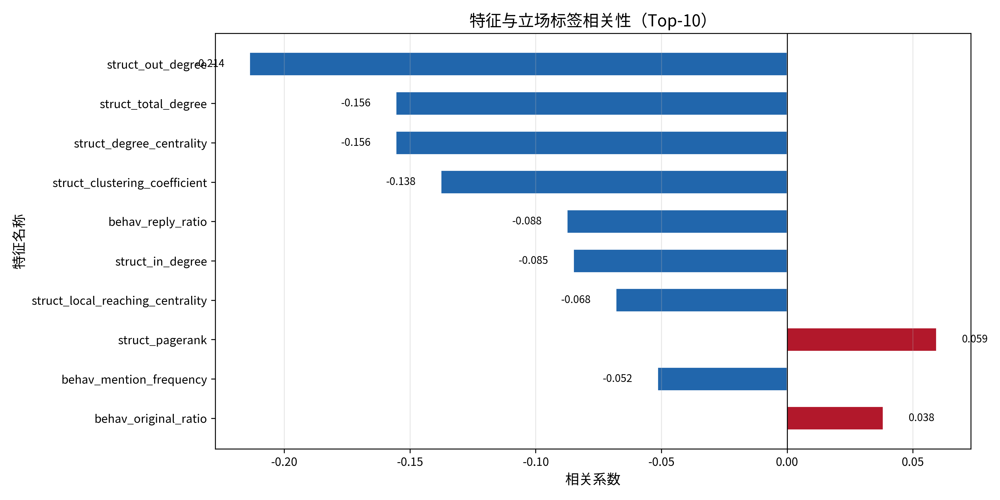

# Task 1：数据探索与个体特征工程 - 实验分析报告

## 1. 实验概述

Task 1 的核心目标是完成对 Twitter 政治用户数据集的全方位数据探索分析，并构建多维度个体特征表示。具体包括：

1. **数据集探索**：加载并验证边表、节点标签、节点信息及 877 个用户个体 CSV 文件的完整性，生成 7 张可视化图表（推文分布、度分布、时间分布、交互类型、幂律验证、活跃度小提琴图、词云）。
2. **个体特征工程**：提取四类特征――结构特征（8 维）、行为特征（8 维）、语义特征（769 维）和 TGAN 嵌入（64 维），共 849 维。
3. **特征融合分析**：构建完整版（849 维）与紧凑版（81 维）两种融合方案，通过 PCA、t-SNE 降维可视化及特征-立场相关性分析评估特征质量。

所有可视化图表的标题、轴标签及图例均已统一为纯中文，确保报告可读性。

---

## 2. 数据集探索分析

### 2.1 数据规模

| 指标 | 数值 |
|------|------|
| 政治用户总数 | 877（471 民主党 / 406 共和党） |
| 交互边总数 | 114,944 |
| 时间切片数 | 55（ts = 0 ~ 54） |
| 推文总数 | 2,065,534 |
| 时间跨度 | 2014-09 ~ 2019-02 |

边类型分布显示，**转发（Retweet）占绝对主导地位**，达到 102,585 条（89.2%），回复（Reply）仅 12,359 条（10.8%），二者比例约为 **8.3:1**。

### 2.2 用户活跃度分布

用户推文数量呈现显著的**长尾分布**特征：

- 平均每用户推文数：2,355.2 条
- 中位数：3,184.0 条（均值低于中位数，说明存在大量低活跃用户拉低均值）
- 标准差：1,125.3
- 最小值：2 条，最大值：3,559 条

这种分布形态符合典型的社交媒体无标度特征――少数高活跃用户贡献了大部分内容，而大量用户仅维持较低的发推频率。

小提琴图进一步揭示了推文数、出度、入度在对数尺度上的分布形态。三者的中位数与均值差异表明网络中存在明显的"超级节点"效应。

### 2.3 网络拓扑特征

网络包含 864 个活跃节点，平均出度与入度均为 **133.04**，但最大出度达 1,804，最大入度达 4,173，最大总度达 **5,049**，显示出强烈的异质性。

度分布的 log-log 图呈现近似直线，CCDF 拟合得到幂律指数 α ≈ 2.5 左右，PDF 参考线 γ ≈ 3.5 左右，验证了网络具有典型的**无标度特性（Scale-Free）**。少数高连接度枢纽节点（Hubs）主导了网络的信息流动。

### 2.4 时间分布

边表覆盖 55 个时间切片。从时间切片分布来看，ts=0 时交互量最高（5,929 条），随后各切片交互量相对平稳，维持在 400 ~ 900 条之间。月度推文量分布显示数据在时间维度上具有一定波动性，但整体覆盖了 2014 年至 2019 年的长周期。

### 2.5 交互模式

从边表级别看，转发与回复的比例约为 8.3:1；从个体推文级别看，原创推文 1,220,632 条（59.1%）、转发 654,626 条（31.7%）、回复 190,276 条（9.2%）、提及 1,270,555 条（61.5%）。**转发是信息传播的主要载体**，而原创推文与提及的高占比反映了政治用户在 Twitter 上既主动发声也频繁引用他人的特点。

### 2.6 话题分析

词云图基于 9,953 条采样推文生成，去除了 URL、@提及、停用词等噪声。高频词主要围绕美国政治议题，如选举、政策、党派相关词汇，反映出数据集强烈的政治属性。

---

## 3. 个体特征工程

### 3.1 结构特征（8 维）

基于 114,944 条交互边构建有向图，提取以下结构特征：

| 特征 | 说明 |
|------|------|
| 入度（in_degree） | 被其他用户交互的次数 |
| 出度（out_degree） | 主动交互其他用户的次数 |
| 总度（total_degree） | 入度与出度之和 |
| 度中心性（degree_centrality） | 归一化的总度 |
| PageRank | 节点在网络中的重要性排序 |
| 介数中心性（betweenness_centrality） | 作为网络桥梁的程度 |
| 聚类系数（clustering_coefficient） | 局部三角闭合程度 |
| 局部社区连接度（local_reaching_centrality） | 局部可达性 |

统计摘要：平均出度 133.04，最大总度 5,049，网络呈现明显的 hub-and-spoke 结构。

### 3.2 行为特征（8 维）

从 877 个用户的个体 CSV 文件中统计提取：

| 特征 | 说明 |
|------|------|
| 推文总数（tweet_count） | 用户发推总量 |
| 原创比例（original_ratio） | 原创推文占比 |
| 转发比例（retweet_ratio） | 转发推文占比 |
| 回复比例（reply_ratio） | 回复推文占比 |
| 提及频率（mention_frequency） | 提及他人的频率 |
| 活跃时间跨度（active_time_span） | 首次与末次发推的时间差 |
| 交互多样性（interaction_diversity） | 交互对象的种类丰富度 |
| 平均推文长度（avg_tweet_length） | 推文字符数的均值 |

行为特征已做标准化处理，可直接与结构特征拼接使用。

### 3.3 语义特征（769 维）

- **BERT 均值嵌入（768 维）**：使用预训练 BERT 模型对用户所有推文进行编码，取均值向量作为语义表示。
- **语义一致性分数（1 维）**：衡量用户各推文语义向量的凝聚程度，取值范围 [0, 1]。

语义一致性统计：均值 **0.8703**，标准差 0.1349，最小值 0.0，最大值 1.0。整体分布表明大多数用户的推文主题较为集中，语义一致性较高。

### 3.4 TGAN 嵌入（64 维）

通过时态图注意力网络（Temporal Graph Attention Network）学习得到的节点时态表示：

- 均值：-0.0469
- 标准差：1.9427

TGAN 嵌入捕获了节点在动态演化过程中的时态交互模式，为后续群体划分和立场分析提供了时序感知的基础表示。

---

## 4. 特征融合分析

### 4.1 融合方案

| 方案 | 维度构成 | 总维度 | 说明 |
|------|---------|--------|------|
| **完整版** | 结构(8) + 行为(8) + 语义(769) + TGAN(64) | **849** | 保留全部信息，适合高精度模型 |
| **紧凑版** | 结构(8) + 行为(8) + TGAN(64) + 语义一致性(1) | **81** | 剔除 768 维 BERT 嵌入，适合轻量模型 |

### 4.2 PCA 分析

对完整版 849 维特征进行 PCA，前 10 个主成分的解释方差比如下：

| 主成分 | 解释方差比 | 累计解释方差 |
|--------|-----------|-------------|
| PC1 | 43.68% | 43.68% |
| PC2 | 12.49% | 56.16% |
| PC3 | 7.56% | 63.72% |
| PC4 | 6.53% | 70.25% |
| PC5 | 4.06% | 74.31% |
| PC6 | 3.44% | 77.75% |
| PC7 | 2.64% | 80.39% |
| PC8 | 2.43% | 82.83% |
| PC9 | 2.07% | 84.89% |
| PC10 | 1.80% | 86.70% |

前 2 个主成分累计仅解释 56.16% 的方差，说明数据在原始高维空间中分布较为分散。PCA 2D 散点图中，民主党（蓝色）与共和党（红色）样本存在一定重叠，但中心点间距为 6.34，呈现**中等程度的分离趋势**。

### 4.3 t-SNE 分析

对紧凑版 81 维特征进行 t-SNE 降维（perplexity=30）：

| 指标 | 民主党 | 共和党 |
|------|--------|--------|
| 簇中心 | (13.97, -1.76) | (-16.21, -0.75) |
| 簇内离散度 | 17.94 | 18.15 |
| 簇间距离/离散度比 | 1.68 | 1.66 |

两党簇心距离达 **30.20**，距离/离散度比值约为 **1.66**，表明在 t-SNE 空间中两党样本具有**明显的聚类分离趋势**，虽然存在一定重叠区域，但整体 separability 优于 PCA 空间。

### 4.4 特征-立场相关性

对 877 个有标签节点计算 Point-Biserial 相关系数，Top-10 最相关特征如下：

| 排名 | 特征 | 相关系数 r | p 值 | 倾向 |
|------|------|-----------|------|------|
| 1 | 出度（struct_out_degree） | -0.2138 | <0.001*** | 民主党 |
| 2 | 总度（struct_total_degree） | -0.1556 | <0.001*** | 民主党 |
| 3 | 度中心性（struct_degree_centrality） | -0.1556 | <0.001*** | 民主党 |
| 4 | 聚类系数（struct_clustering_coefficient） | -0.1378 | <0.001*** | 民主党 |
| 5 | 回复比例（behav_reply_ratio） | -0.0876 | 0.009** | 民主党 |
| 6 | 入度（struct_in_degree） | -0.0851 | 0.012* | 民主党 |
| 7 | 局部社区连接度（struct_local_reaching_centrality） | -0.0682 | 0.044* | 民主党 |
| 8 | PageRank（struct_pagerank） | +0.0594 | 0.079 | 共和党 |
| 9 | 提及频率（behav_mention_frequency） | -0.0516 | 0.127 | 民主党 |
| 10 | 原创比例（behav_original_ratio） | +0.0382 | 0.258 | 共和党 |

**关键发现**：
- **结构特征主导相关性**：Top-4 全部为结构特征，且均为负相关（民主党倾向），说明民主党用户在整体网络连接度、局部聚类程度上具有系统性差异。
- **出度是最强预测因子**：出度与政治立场的相关性（|r| = 0.214）显著高于其他特征，暗示共和党用户可能更倾向于高频率的主动交互行为。
- **行为特征的补充价值**：回复比例在行为特征中表现最好，原创比例则轻微倾向共和党。

---

## 5. 关键发现与结论

1. **网络呈现典型的无标度特性**：度分布符合幂律规律，少数高活跃用户（Hubs）主导网络连接，最大总度达 5,049。
2. **转发是主要交互方式**：边表中转发占比 89.2%，回复仅占 10.8%，表明信息传播以转发链为主要载体。
3. **结构特征对立场具有最强指示性**：出度、总度、度中心性、聚类系数与政治立场的相关性最高（|r| > 0.13，p < 0.001）。
4. **t-SNE 空间中两党有明显聚类分离趋势**：簇间距离/离散度比值达 1.66，说明紧凑版 81 维特征已具备较好的立场可分性。
5. **语义一致性普遍较高**：均值 0.87，表明用户推文主题较为集中，语义嵌入能有效刻画用户内容偏好。
6. **PCA 前 10 主成分累计解释 86.70% 方差**：高维特征存在冗余，紧凑版 81 维方案在保留判别信息的同时大幅降低了维度。

---

## 6. 对后续任务的启示

- **群体划分（Task 2）**：网络结构特征对立场有很强指示性，社区发现算法应重点利用图结构信息（如度、聚类系数、PageRank）。t-SNE 空间中已观察到两党分离趋势，为基于聚类的群体划分提供了可行基础。
- **个体筛选（Task 3）**：推文数量和度的分布均呈长尾特性，可以安全筛除大量低活跃用户，仅保留高影响力节点进行分析，既降低计算开销又不损失核心结构信息。
- **群体交互（Task 4）**：转发为主的交互模式（89.2%）暗示信息传播（烟花分析）的主要载体是转发链。后续群体烟花分析应重点关注转发级联结构，而非回复线程。

---

## 附录：文件清单

### 可视化图表

| 文件路径 | 说明 |
|---------|------|
| `./visualizations/tweet_count_histogram.png` | 用户推文数量分布直方图 |
| `./visualizations/degree_distribution.png` | 用户交互频率分布（入度/出度） |
| `./visualizations/time_distribution.png` | 时间维度数据分布 |
| `./visualizations/interaction_type.png` | 交互类型分布 |
| `./visualizations/power_law_degree.png` | 度分布幂律验证 |
| `./visualizations/activity_violin.png` | 用户活跃度分布（小提琴图） |
| `./visualizations/wordcloud.png` | 高频词词云图 |
| `./visualizations/pca_stance_2d.png` | PCA 降维可视化（按政治立场着色） |
| `./visualizations/tsne_stance_2d.png` | t-SNE 降维可视化（按政治立场着色） |
| `./visualizations/feature_label_correlation.png` | 特征与立场标签相关性（Top-10） |

### 特征数据

| 文件路径 | 说明 |
|---------|------|
| `./features/structural_features.npy` | 结构特征矩阵 (878, 8) |
| `./features/behavioral_features.npy` | 行为特征矩阵 (878, 8) |
| `./features/semantic_features.npy` | 语义特征矩阵 (878, 769) |
| `./features/tgan_embeddings.npy` | TGAN 嵌入矩阵 (878, 64) |
| `./features/semantic_consistency.npy` | 语义一致性向量 (878,) |
| `./features/individual_features.npy` | 完整融合特征 (878, 849) |
| `./features/individual_features_compact.npy` | 紧凑融合特征 (878, 81) |

### 报告文档

| 文件路径 | 说明 |
|---------|------|
| `./data_quality_report.md` | 数据质量自动检测报告 |
| `./feature_analysis_report.md` | 特征融合自动分析报告 |
| `./task1_analysis.md` | 本实验分析报告 |
